<h1 align="center">
  🐰 Directus — Headless CMS<br>
  <sub>Instalasi & Deployment di <a href="https://cms.asqara.tech">cms.asqara.tech</a></sub>
</h1>

<p align="center">
  
  
  
  
  
  
</p>

<p align="center">
  <b>🌐 Demo langsung:</b> <a href="https://cms.asqara.tech/admin">cms.asqara.tech/admin</a> &nbsp;•&nbsp;
  <b>📡 API publik:</b> <a href="https://cms.asqara.tech/items/articles">cms.asqara.tech/items/articles</a>
</p>

<p align="center">
  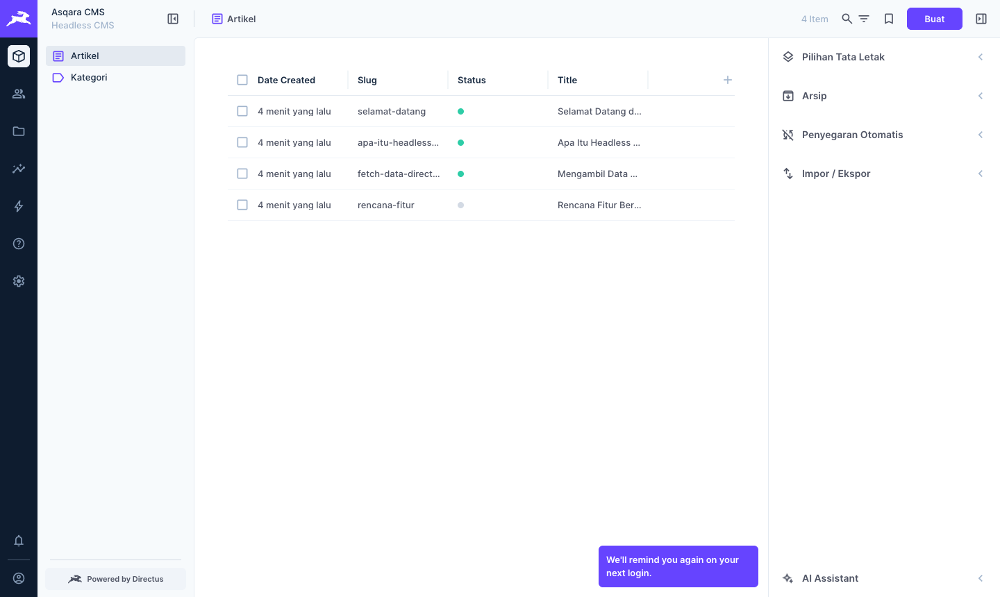
</p>

[Sekilas Tentang](#sekilas-tentang) | [Instalasi](#instalasi) | [Tunnel](#tunnel) | [Konfigurasi](#konfigurasi) | [Otomatisasi](#otomatisasi) | [Cara Pemakaian](#cara-pemakaian) | [Maintenance](#maintenance) | [Pembahasan](#pembahasan) | [Referensi](#referensi)
:---:|:---:|:---:|:---:|:---:|:---:|:---:|:---:|:---:

---

## 👥 Anggota Kelompok

| Nama | NIM | Peran |
|---|---|---|
| Alfath Asqar Tsani | M0403241019 | Instalasi server & deployment |
| _Nama Anggota 2_ | _G64xxxxxxx_ | Dokumentasi & konten |
| _Nama Anggota 3_ | _G64xxxxxxx_ | Pembahasan & perbandingan |

---

## ⚡ TL;DR — Mau Cepat?

Punya server Ubuntu dan domain yang sudah diarahkan ke IP server? Cukup **3 perintah**:

```bash
git clone https://github.com/asqara/directus-deploy.git /opt/directus
cd /opt/directus
sudo DOMAIN=cms.asqara.tech EMAIL=admin@asqara.tech ./setup.sh
```

Tunggu ±3 menit, lalu buka `https://cms.asqara.tech/admin`. Email & password admin akan ditampilkan di akhir proses. 🎉

> Ingin paham apa yang sebenarnya terjadi? Ikuti [Instalasi Manual](#instalasi) langkah demi langkah di bawah.

---

<a id="sekilas-tentang"></a>

# 📖 Sekilas Tentang
[`^ kembali ke atas ^`](#)

**Directus** adalah **headless CMS** (*Content Management System*) *open source* yang membungkus database SQL apa pun menjadi:

1. **REST API & GraphQL API** secara instan, dan
2. **Panel admin (Directus Studio)** yang cantik dan mudah dipakai orang non-teknis.

Directus pertama kali dibuat pada tahun **2004** oleh **Ben Haynes** di agensi RANGER Studio (New York) sebagai alat internal untuk mengelola konten klien, lalu dirilis sebagai *open source*. Pada 2020–2021, Directus ditulis ulang total (versi 9) menggunakan **Node.js** dan **Vue.js**, dan kini dikembangkan oleh perusahaan **Monospace Inc.** Versi yang dipakai di laporan ini adalah **Directus 12.4.1** (rilis 23 September 2026).

### 🤔 Apa itu *headless* CMS?

CMS tradisional seperti WordPress menggabungkan **"kepala"** (tampilan website) dengan **"badan"** (pengelolaan konten). Headless CMS hanya menyediakan **badan**-nya saja, sedangkan konten dikirim melalui API sehingga bisa ditampilkan di mana saja: website, aplikasi mobile, *smart TV*, bahkan papan pengumuman digital.

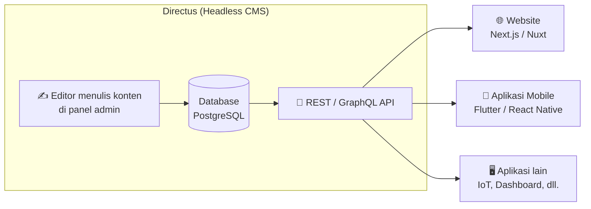

### ✨ Fitur Unggulan

| Fitur | Penjelasan singkat |
|---|---|
| 🗄️ **Database-first** | Tidak mengunci data dalam format khusus. Tabel yang dibuat adalah tabel SQL biasa dan bisa dibaca aplikasi lain. |
| ⚡ **API instan** | Setiap koleksi (tabel) otomatis punya endpoint REST & GraphQL, lengkap dengan filter, sort, pagination, dan relasi. |
| 🎨 **No-code data model** | Membuat tabel, kolom, dan relasi cukup dengan klik, tanpa menulis SQL. |
| 🔐 **Hak akses granular** | Atur siapa boleh membaca, membuat, mengubah, atau menghapus data per koleksi & per kolom. |
| 🖼️ **Manajemen file** | Upload gambar/dokumen, lalu *resize* & konversi format gambar langsung lewat URL. |
| 🔄 **Flows (otomatisasi)** | Membuat alur otomatis seperti "kirim email saat artikel dipublikasikan" tanpa coding. |
| ⚡ **Realtime** | Dukungan WebSocket untuk aplikasi yang butuh data *live*. |
| 🌍 **Multi-bahasa** | Panel admin tersedia dalam puluhan bahasa, termasuk **Bahasa Indonesia**. |

---

<a id="instalasi"></a>

# 🛠 Instalasi
[`^ kembali ke atas ^`](#)

### 🏗️ Arsitektur yang Akan Dibangun

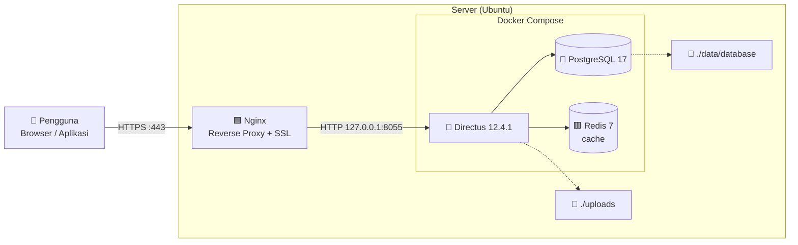

**Kenapa pakai arsitektur ini?**
- **Docker** → semua komponen (Directus, database, cache) terisolasi dan bisa dipasang dengan **satu perintah**, tanpa bentrok dengan aplikasi lain di server.
- **PostgreSQL** → database yang paling direkomendasikan oleh tim Directus.
- **Redis** → menyimpan *cache* agar API jauh lebih cepat.
- **Nginx** → menjadi "pintu depan" yang menangani HTTPS; Directus sendiri **tidak terbuka langsung** ke internet (hanya `127.0.0.1`).

### 📋 Kebutuhan Sistem

| Komponen | Minimum | Rekomendasi | Yang kami pakai |
|---|---|---|---|
| Sistem Operasi | Linux 64-bit (Ubuntu 22.04+ / Debian 12+) | Ubuntu 24.04 LTS | Ubuntu 26.04 LTS |
| CPU | 1 vCPU | 2 vCPU | 6 vCPU |
| RAM | 1 GB | 2 GB+ | 16GB |
| Penyimpanan | 10 GB | 20 GB+ (tergantung jumlah file upload) | 256GB |
| Domain | Opsional (bisa pakai IP) | Subdomain + HTTPS | `cms.asqara.tech` |
| Port terbuka | 22 (SSH), 80 (HTTP) | 22, 80, 443 — atau **0 port** via [Cloudflare Tunnel](#tunnel) | Cloudflare Tunnel (0 port) |

> [!NOTE]
> Tidak perlu menginstal Node.js, PostgreSQL, atau Redis secara manual. Semuanya sudah dibungkus di dalam **Docker**.

---

## Langkah 0 — Arahkan Domain ke Server (DNS)

Buka panel pengelola domain (mis. Cloudflare, Niagahoster, Namecheap, dsb.), lalu tambahkan **A record**:

| Type | Name | Value | TTL |
|---|---|---|---|
| `A` | `cms` | `<IP publik server>` | Auto |

> [!IMPORTANT]
> Jika memakai **Cloudflare**, set *Proxy status* ke **DNS only** (awan abu-abu) dulu sampai sertifikat HTTPS berhasil dibuat di Langkah 8. Setelah itu boleh diaktifkan kembali dengan mode SSL **Full (strict)**.

> [!TIP]
> **Server di rumah/lab di belakang router (mis. IndiHome) dan tidak punya IP publik?** Lewati Langkah 0 & 8 ini, dan pakai [🌩️ Deploy dengan Cloudflare Tunnel](#tunnel) — cara yang kami pakai untuk `cms.asqara.tech`.

✅ **Cek:** dari laptop, jalankan perintah berikut. Hasilnya harus IP server kamu.

```bash
nslookup cms.asqara.tech
```

---

## Langkah 1 — Masuk ke Server via SSH

```bash
ssh user@<IP-server>
```

> 💡 **Pengguna Windows:** bisa langsung pakai **PowerShell / Windows Terminal** (sudah ada `ssh` bawaan) atau aplikasi [PuTTY](https://www.putty.org/).

---

## Langkah 2 — Perbarui Sistem & Instal Paket Dasar

```bash
sudo apt update && sudo apt upgrade -y
sudo apt install -y ca-certificates curl gnupg git jq nginx certbot python3-certbot-nginx
```

| Paket | Fungsi |
|---|---|
| `git` | Mengunduh repository ini |
| `jq` | Membaca JSON (dipakai script seed) |
| `nginx` | Web server / reverse proxy |
| `certbot`, `python3-certbot-nginx` | Membuat sertifikat HTTPS gratis dari Let's Encrypt |

---

## Langkah 3 — Instal Docker Engine & Docker Compose

Kita memakai repository resmi Docker agar mendapat versi terbaru:

```bash
# Tambahkan kunci GPG resmi Docker
sudo install -m 0755 -d /etc/apt/keyrings
sudo curl -fsSL https://download.docker.com/linux/ubuntu/gpg -o /etc/apt/keyrings/docker.asc
sudo chmod a+r /etc/apt/keyrings/docker.asc

# Tambahkan repository Docker
echo "deb [arch=$(dpkg --print-architecture) signed-by=/etc/apt/keyrings/docker.asc] \
https://download.docker.com/linux/ubuntu $(. /etc/os-release && echo $VERSION_CODENAME) stable" \
| sudo tee /etc/apt/sources.list.d/docker.list > /dev/null

# Instal Docker
sudo apt update
sudo apt install -y docker-ce docker-ce-cli containerd.io docker-buildx-plugin docker-compose-plugin

# (Opsional) agar bisa menjalankan docker tanpa sudo
sudo usermod -aG docker $USER && newgrp docker
```

✅ **Cek:**

```bash
docker --version && docker compose version
```

<details>
<summary>Contoh output yang benar</summary>

```
Docker version 29.x.x, build xxxxxxx
Docker Compose version v2.x.x
```
</details>

---

## Langkah 4 — Unduh Konfigurasi dari Repository Ini

```bash
sudo git clone https://github.com/asqara/directus-deploy.git /opt/directus
sudo chown -R $USER:$USER /opt/directus
cd /opt/directus
```

Isi repository:

```
directus-deploy/
├── docker-compose.yml        ← definisi 3 container (Directus, PostgreSQL, Redis)
├── .env.example              ← contoh konfigurasi (disalin jadi .env)
├── setup.sh                  ← instalasi otomatis 1 perintah
├── nginx/
│   └── cms.asqara.tech.conf  ← konfigurasi reverse proxy
├── scripts/
│   ├── seed.sh               ← mengisi konten contoh via API
│   ├── backup.sh             ← backup database + file
│   └── restore.sh            ← mengembalikan backup
└── docs/images/              ← screenshot untuk dokumentasi
```

---

## Langkah 5 — Buat File Konfigurasi `.env`

Salin template lalu isi nilainya:

```bash
cp .env.example .env
```

Buat nilai acak yang kuat untuk `SECRET` dan password database:

```bash
echo "SECRET=$(openssl rand -hex 32)"
echo "DB_PASSWORD=$(openssl rand -hex 24)"
```

Lalu edit file `.env`:

```bash
nano .env
```

Bagian yang **wajib** diubah:

```ini
PUBLIC_URL=https://cms.asqara.tech
SECRET=<tempel hasil openssl rand -hex 32>
DB_PASSWORD=<tempel hasil openssl rand -hex 24>
ADMIN_EMAIL=admin@asqara.tech
ADMIN_PASSWORD=<password admin yang kuat>
```

Simpan dengan `Ctrl + O` → `Enter`, keluar dengan `Ctrl + X`. Lalu kunci izin file agar hanya pemilik yang bisa membaca:

```bash
chmod 600 .env
```

> [!WARNING]
> File `.env` berisi password. **Jangan pernah** meng-*commit* file ini ke GitHub (sudah dicegah oleh `.gitignore`).

---

## Langkah 6 — Jalankan Directus

```bash
# Buat folder penyimpanan data
mkdir -p data/database uploads extensions

# Container Directus berjalan sebagai user "node" (UID 1000),
# jadi folder upload harus bisa ditulis oleh UID tersebut
sudo chown -R 1000:1000 uploads extensions

# Unduh image & jalankan di background
docker compose up -d
```

Proses pertama memakan waktu 1–3 menit (mengunduh image ±500 MB & membuat tabel database).

✅ **Cek:** semua container harus berstatus **healthy**.

```bash
docker compose ps
```

<details>
<summary>Contoh output yang benar</summary>

```
NAME             IMAGE                      STATUS                   PORTS
directus-app     directus/directus:12.4.1   Up 1 minute (healthy)    127.0.0.1:8055->8055/tcp
directus-cache   redis:7-alpine             Up 1 minute (healthy)    6379/tcp
directus-db      postgres:17-alpine         Up 1 minute (healthy)    5432/tcp
```
</details>

```bash
curl http://127.0.0.1:8055/server/ping
# output: pong
```

---

## Langkah 7 — Pasang Nginx sebagai Reverse Proxy

Salin konfigurasi yang sudah disediakan:

```bash
sudo cp nginx/cms.asqara.tech.conf /etc/nginx/sites-available/cms.asqara.tech
sudo ln -s /etc/nginx/sites-available/cms.asqara.tech /etc/nginx/sites-enabled/
sudo nginx -t                      # uji konfigurasi, harus "syntax is ok"
sudo systemctl enable --now nginx  # pastikan Nginx menyala & otomatis jalan saat boot
sudo systemctl reload nginx
```

<details>
<summary>📄 Isi <code>nginx/cms.asqara.tech.conf</code> (klik untuk melihat)</summary>

```nginx
server {
    listen 80;
    listen [::]:80;
    server_name cms.asqara.tech;

    # Samakan dengan FILES_MAX_UPLOAD_SIZE di .env
    client_max_body_size 100M;

    location / {
        # Maintenance mode: aktif jika file ini ada
        if (-f /var/www/html/maintenance.html) { return 503; }

        proxy_pass http://127.0.0.1:8055;
        proxy_http_version 1.1;

        # Header standar reverse proxy
        proxy_set_header Host              $host;
        proxy_set_header X-Real-IP         $remote_addr;
        proxy_set_header X-Forwarded-For   $proxy_add_x_forwarded_for;
        proxy_set_header X-Forwarded-Proto $scheme;

        # WebSocket (fitur realtime Directus)
        proxy_set_header Upgrade    $http_upgrade;
        proxy_set_header Connection "upgrade";

        proxy_read_timeout 300s;
    }

    error_page 503 @maintenance;
    location @maintenance {
        root /var/www/html;
        rewrite ^ /maintenance.html break;
    }
}
```
</details>

Jika firewall **UFW** aktif, buka port web:

```bash
sudo ufw allow 'Nginx Full'
```

✅ **Cek:** buka `http://cms.asqara.tech` di browser, halaman login Directus harus muncul.

---

## Langkah 8 — Aktifkan HTTPS Gratis (Let's Encrypt)

```bash
sudo certbot --nginx -d cms.asqara.tech -m admin@asqara.tech --agree-tos --redirect
```

Certbot akan otomatis membuat sertifikat, menambahkannya ke konfigurasi Nginx, dan mengarahkan semua HTTP ke HTTPS. Sertifikat juga **diperpanjang otomatis** setiap 90 hari.

✅ **Cek perpanjangan otomatis:**

```bash
sudo certbot renew --dry-run
```

---

## Langkah 9 — Login Pertama Kali 🎉

Buka **https://cms.asqara.tech/admin**, lalu masuk dengan `ADMIN_EMAIL` dan `ADMIN_PASSWORD` dari file `.env`.

<p align="center">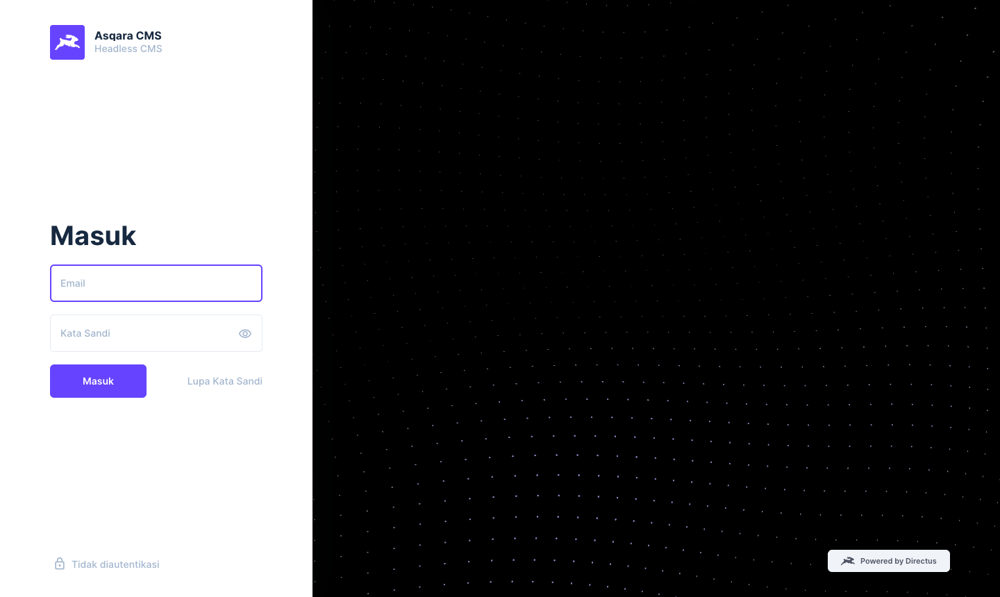</p>

Saat pertama login, Directus 12 akan menampilkan **dua dialog**:

| Dialog | Apa yang harus dilakukan |
|---|---|
| **"Have a license key?"** | Pilih **I'm using Core plan** (gratis) lalu **Simpan**. Jika punya lisensi, pilih *I have a license key*. |
| **"You have not set a project owner"** | Isi email penanggung jawab proyek, centang persetujuan lisensi **MSCL-1.0-GPL**, lalu klik **Set Owner**. |

<p align="center">
  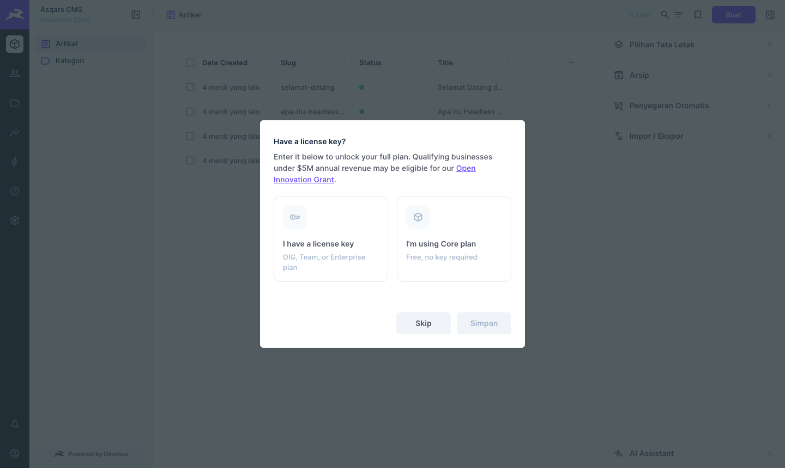
  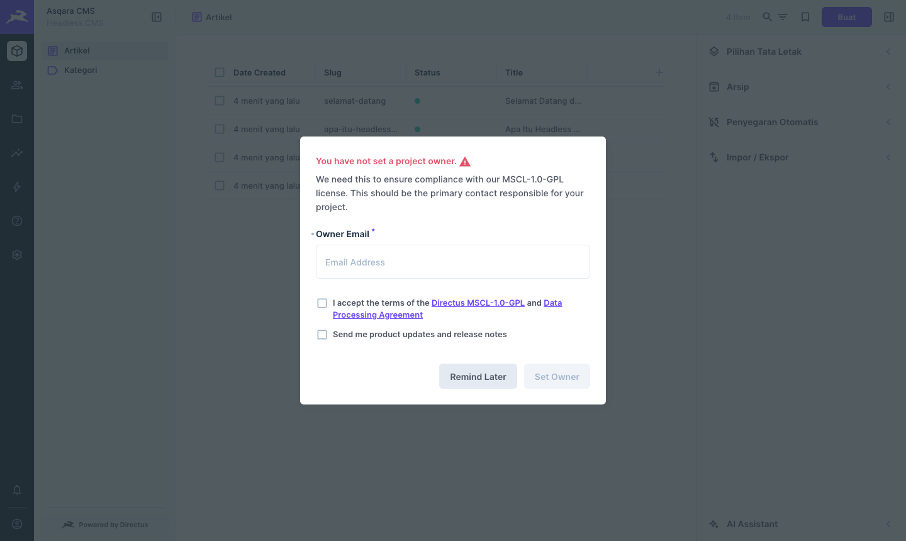
</p>

> [!TIP]
> **Segera ganti password admin** setelah login pertama: klik ikon profil di kiri bawah → ubah **Password** → **Simpan**.

✅ **Instalasi selesai!** Lanjut ke [Cara Pemakaian](#cara-pemakaian) untuk mulai mengisi konten.

---

<a id="tunnel"></a>

## 🌩️ Deploy dengan Cloudflare Tunnel (Server di Belakang NAT / IndiHome)

> [!NOTE]
> **Inilah cara yang benar-benar kami pakai untuk `cms.asqara.tech`.** Ikuti bagian ini **sebagai pengganti Langkah 0 dan Langkah 8** jika servermu berada di rumah/lab di belakang router dan **tidak** punya IP publik yang bisa di-*port forward*.

### 🤔 Kenapa perlu tunnel?

Server kami berada di jaringan rumah dengan susunan **double NAT**: server ada di belakang **router TP-Link**, dan router itu sendiri ada di belakang **modem IndiHome**. Akibatnya:

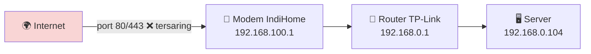

- IP yang didapat server (`192.168.0.104`) adalah **IP lokal**, tidak bisa diakses dari internet.
- **Port forwarding gagal** karena harus diatur di **dua perangkat**, dan modem IndiHome sering terkunci (butuh akun admin yang dipegang Telkom).

**Cloudflare Tunnel** menyelesaikan ini tanpa menyentuh router/modem sama sekali: server membuat koneksi **keluar** ke Cloudflare, lalu semua pengunjung dialirkan lewat koneksi itu.

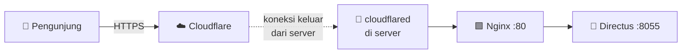

| Kelebihan | |
|---|---|
| ✅ Tidak butuh IP publik | Lolos dari CGNAT & double NAT |
| ✅ Tidak menyentuh router/modem | Tidak perlu port forwarding sama sekali |
| ✅ HTTPS otomatis dari Cloudflare | **Certbot / Langkah 8 tidak dipakai** |
| ✅ Gratis | Cukup punya domain yang name server-nya di Cloudflare |

### Langkah 1 — Hapus A record lama

Di **Cloudflare → DNS → Records**, **hapus** A record `cms` yang mengarah ke IP lokal/publik. Tunnel akan membuat record-nya sendiri secara otomatis (kalau dibiarkan, keduanya bentrok).

### Langkah 2 — Buat tunnel di dashboard

1. Buka **Cloudflare dashboard → Zero Trust → Networks → Tunnels → Create a tunnel**.
2. Pilih **Cloudflared** → beri nama (mis. `asqara-server`) → **Save tunnel**.

### Langkah 3 — Install `cloudflared` di server

Pilih **Debian / 64-bit** di dashboard. Cloudflare menampilkan perintah **yang sudah berisi token unik** — jalankan apa adanya di server. Bentuknya kira-kira:

```bash
# Perintah 1: install (ambil dari dashboard)
curl -L https://github.com/cloudflare/cloudflared/releases/latest/download/cloudflared-linux-amd64.deb -o cloudflared.deb
sudo dpkg -i cloudflared.deb

# Perintah 2: daftarkan sebagai service (TOKEN dari dashboard)
sudo cloudflared service install <TOKEN_PANJANG_DARI_DASHBOARD>
```

Tunggu ±30 detik hingga status tunnel di dashboard menjadi **Healthy / Connected**.

✅ **Cek:**

```bash
sudo systemctl status cloudflared --no-pager | head -5
```

### Langkah 4 — Arahkan tunnel ke Nginx

Di bagian **Public Hostname** tunnel, isi **persis** seperti ini:

| Kolom | Isi | ⚠️ Catatan |
|---|---|---|
| Subdomain | `cms` | |
| Domain | `asqara.tech` | |
| Type | **HTTP** | **Jangan HTTPS** — Nginx lokal memakai HTTP biasa |
| URL | `localhost:80` | Arahkan ke **Nginx**, bukan `8055`, agar maintenance mode & batas upload tetap berlaku |

Klik **Save**.

> [!WARNING]
> Salah pilih **Type: HTTPS** di sini adalah penyebab **error 502 Bad Gateway** paling umum: cloudflared mencoba TLS ke port 80 yang HTTP biasa, lalu gagal. Pastikan **HTTP**.

### Langkah 5 — Pastikan Nginx TANPA redirect HTTPS

Karena HTTPS ditangani Cloudflare, Nginx cukup melayani HTTP di port 80. **Jangan jalankan certbot** pada skema ini. Jika sebelumnya sempat menjalankan certbot (Langkah 8), kembalikan konfigurasi Nginx ke versi bersih dari repo:

```bash
sudo cp nginx/cms.asqara.tech.conf /etc/nginx/sites-available/cms.asqara.tech
sudo nginx -t && sudo systemctl reload nginx
```

> [!WARNING]
> **Error `ERR_TOO_MANY_REDIRECTS`?** Penyebabnya sisa aturan "paksa ke HTTPS" dari certbot. Cloudflare mengirim HTTPS → Nginx menyuruh "pindah ke HTTPS" lagi → berputar tanpa henti. Perintah di atas menghapusnya.

### Langkah 6 — Set `PUBLIC_URL` & restart

```bash
# Pastikan PUBLIC_URL memakai https (alamat publik dari Cloudflare)
grep PUBLIC_URL .env      # harus: PUBLIC_URL=https://cms.asqara.tech
docker compose up -d
```

### ✅ Verifikasi dari internet

Uji dari **HP dengan data seluler** (matikan WiFi) atau minta bantuan teman di jaringan lain:

```bash
curl -I https://cms.asqara.tech/admin          # harus: HTTP/2 200
curl https://cms.asqara.tech/server/ping        # harus: pong
```

Buka **https://cms.asqara.tech/admin** — panel Directus kini dapat diakses dari mana saja, lengkap dengan HTTPS, **tanpa membuka satu port pun** di rumah. 🎉

### 🩺 Troubleshooting Tunnel

| Gejala | Penyebab | Solusi |
|---|---|---|
| **502 Bad Gateway** (diagram: *Cloudflare ✅, Host ❌*) | Public Hostname memakai **Type HTTPS** atau URL salah | Ubah ke **Type HTTP**, URL `localhost:80` |
| **502**, padahal Type sudah HTTP | Nginx/Directus mati | `docker compose ps` & `sudo systemctl status nginx` |
| **ERR_TOO_MANY_REDIRECTS** | Sisa redirect certbot di Nginx | Lihat [Langkah 5](#tunnel) di atas, lalu buka di jendela incognito |
| Tunnel **Down** di dashboard | `cloudflared` mati | `sudo systemctl restart cloudflared`, cek `sudo journalctl -u cloudflared -n 30` |
| Domain tak kunjung aktif | A record lama masih ada | Hapus A record `cms` yang lama di Cloudflare DNS |

---

<a id="vm-lokal"></a>

## 💻 Instalasi di VM Lokal (Tanpa Domain)

Untuk latihan di VirtualBox/VMware (sesuai agenda tugas), langkahnya **sama persis**, hanya saja:

1. Atur *Network Adapter* VM ke **Bridged** atau **Host-only** agar VM punya IP yang bisa diakses dari laptop (cek dengan `ip a`).
2. Di `.env`, isi `PUBLIC_URL=http://<IP-VM>` (pakai `http`, bukan `https`).
3. Di file Nginx, ganti `server_name cms.asqara.tech;` menjadi `server_name <IP-VM>;`.
4. **Lewati Langkah 0 dan Langkah 8** (DNS & HTTPS).

Atau cukup satu perintah:

```bash
sudo DOMAIN=192.168.56.10 SKIP_SSL=1 ./setup.sh
```

Lalu buka `http://192.168.56.10/admin` dari browser laptop.

---

<a id="konfigurasi"></a>

# ⚙️ Konfigurasi
[`^ kembali ke atas ^`](#)

Semua konfigurasi Directus diatur lewat **environment variable** di file `.env`. Setiap kali mengubah `.env`, terapkan dengan:

```bash
docker compose up -d
```

### 🔑 Variabel Penting

| Variabel | Contoh | Fungsi |
|---|---|---|
| `DIRECTUS_VERSION` | `12.4.1` | Versi Directus yang dipakai. Dikunci agar tidak berubah tiba-tiba. |
| `PUBLIC_URL` | `https://cms.asqara.tech` | Alamat publik. **Wajib benar** agar link file, email, dan lisensi berfungsi. |
| `SECRET` | `a3f9…` (64 karakter) | Kunci untuk menandatangani token login. **Jangan dibagikan.** |
| `DB_*` | `directus` | Nama database, user, dan password PostgreSQL. |
| `ADMIN_EMAIL` / `ADMIN_PASSWORD` | | Akun admin pertama. **Hanya dipakai saat instalasi awal.** |
| `CORS_ORIGIN` | `true` atau `https://asqara.tech` | Domain frontend yang boleh memanggil API dari browser. |
| `FILES_MAX_UPLOAD_SIZE` | `100mb` | Batas ukuran upload (samakan dengan `client_max_body_size` di Nginx). |
| `LICENSE_KEY` | *(kosong)* | Kunci lisensi untuk membuka fitur berbayar. Kosong = tier **Core** (gratis). |
| `EMAIL_*` | | Pengaturan SMTP untuk fitur *lupa password* & undang user. |

Daftar lengkap ada di [dokumentasi resmi konfigurasi Directus](https://directus.com/docs/configuration/general).

### 📧 Mengaktifkan Email (Opsional)

Agar fitur **Lupa Kata Sandi** dan **Undang User** berfungsi, aktifkan SMTP di `.env`. Contoh dengan Gmail (buat *App Password* di pengaturan akun Google):

```ini
EMAIL_TRANSPORT=smtp
EMAIL_FROM=no-reply@asqara.tech
EMAIL_SMTP_HOST=smtp.gmail.com
EMAIL_SMTP_PORT=587
EMAIL_SMTP_USER=akunkamu@gmail.com
EMAIL_SMTP_PASSWORD=xxxx-xxxx-xxxx-xxxx
```

### 🎨 Mengubah Nama, Warna & Bahasa Panel

Masuk ke **Settings (⚙️) → Pengaturan**. Di sini kita bisa mengatur:
- **Nama proyek** & deskripsi (kami pakai *"Asqara CMS — Headless CMS"*)
- **Warna** utama, logo, dan gambar latar halaman login
- **Bahasa default** → pilih **Bahasa Indonesia**

<p align="center">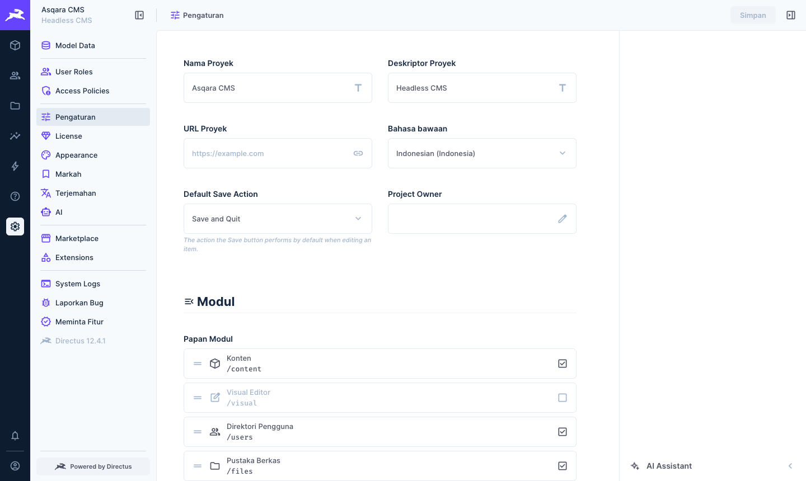</p>

---

<a id="otomatisasi"></a>

# 🤖 Otomatisasi
[`^ kembali ke atas ^`](#)

Semua langkah manual di atas sudah kami bungkus menjadi script agar instalasi bisa diulang kapan saja **tanpa salah ketik**.

### 1. `setup.sh` — Instalasi Penuh dalam 1 Perintah

```bash
sudo DOMAIN=cms.asqara.tech EMAIL=admin@asqara.tech ./setup.sh
```

Yang dilakukan script ([lihat kodenya](setup.sh)):

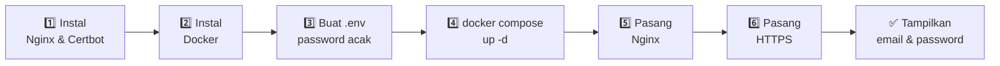

- Password database, `SECRET`, dan password admin **dibuat acak otomatis** menggunakan `openssl`.
- Aman dijalankan ulang (*idempotent*): `.env` yang sudah ada tidak akan ditimpa.

### 2. `scripts/seed.sh` — Isi Konten Contoh Otomatis

Mengisi Directus dengan contoh konten lewat **REST API**: membuat koleksi **Kategori** & **Artikel**, relasi di antara keduanya, 4 artikel contoh, mengubah nama proyek menjadi *Asqara CMS*, dan memberi izin baca untuk publik.

```bash
./scripts/seed.sh
```

<details>
<summary>Contoh output</summary>

```
==> Login sebagai admin@asqara.tech ke https://cms.asqara.tech
==> Mengatur nama & warna proyek
==> Membuat koleksi categories
==> Membuat koleksi articles
==> Membuat relasi articles.category -> categories
==> Mengisi data kategori
==> Mengisi data artikel
==> Memberi izin baca publik

Seed selesai! Coba buka:
   https://cms.asqara.tech/items/articles?fields=title,summary,category.name&filter[status][_eq]=published
```
</details>

### 3. `scripts/backup.sh` — Backup Otomatis Tiap Malam

Pasang *cron job* agar backup berjalan setiap hari pukul 02.00:

```bash
crontab -e
```

Tambahkan baris:

```cron
0 2 * * * /opt/directus/scripts/backup.sh >> /opt/directus/backups/backup.log 2>&1
```

Backup yang lebih tua dari 7 hari dihapus otomatis. Detail lengkap ada di [Maintenance](#maintenance).

---

<a id="cara-pemakaian"></a>

# 📝 Cara Pemakaian
[`^ kembali ke atas ^`](#)

Berikut contoh alur lengkap membuat **website berita/blog**: merancang struktur data → mengisi konten → membukanya ke publik → mengambilnya lewat API.

### Mengenal Tampilan Panel Admin

Menu utama ada di **sidebar kiri**:

| Ikon | Menu | Fungsi |
|:---:|---|---|
| 📦 | **Content** | Menulis & mengelola konten (artikel, kategori, dll.) |
| 👥 | **User Directory** | Mengelola akun pengguna panel |
| 📁 | **File Library** | Mengelola gambar & dokumen yang di-upload |
| 📊 | **Insights** | Membuat dashboard grafik dari data |
| ⚡ | **Flows** | Membuat otomatisasi tanpa coding |
| ⚙️ | **Settings** | Data model, role, hak akses, tampilan, lisensi |

---

### 1️⃣ Merancang Struktur Data (Data Model)

Di Directus, **koleksi** = tabel database, **field** = kolom. Kita akan membuat dua koleksi:

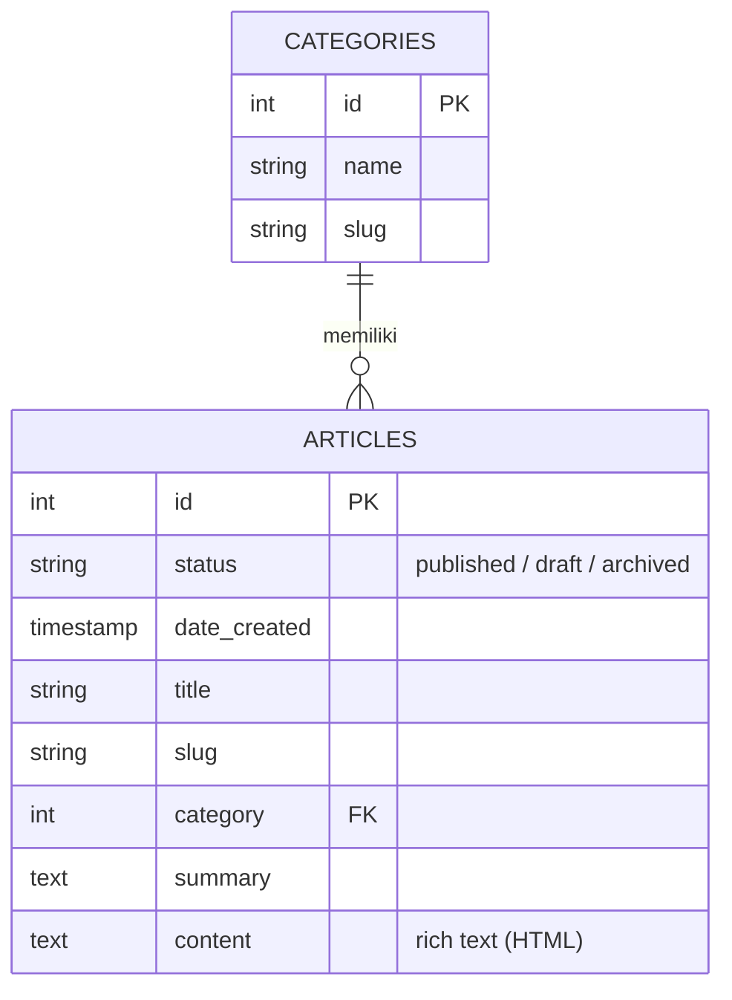

**Langkah membuat koleksi:**

1. Buka **Settings (⚙️) → Model Data** → klik tombol **＋** di kanan atas.
2. Isi nama koleksi, mis. `articles`. Pada tab *Optional Fields*, centang **Status** dan **Date Created**. Klik ✔.
3. Klik **Buat Bidang** untuk menambah field:
   - `title` → tipe **Input**, centang *Required*
   - `slug` → tipe **Input**, aktifkan opsi *Slugify*
   - `summary` → tipe **Textarea**
   - `content` → tipe **WYSIWYG** (editor teks kaya)
   - `category` → tipe **Many to One**, hubungkan ke koleksi `categories`

<p align="center">
  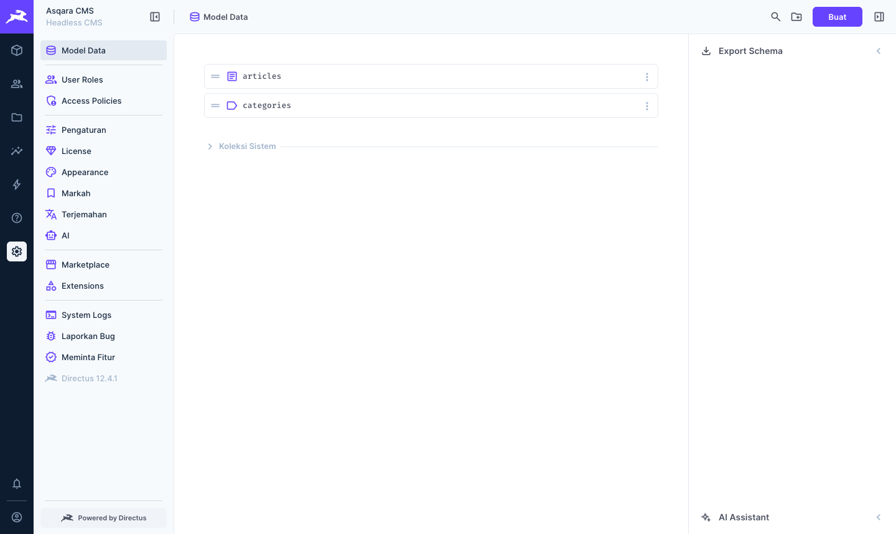
  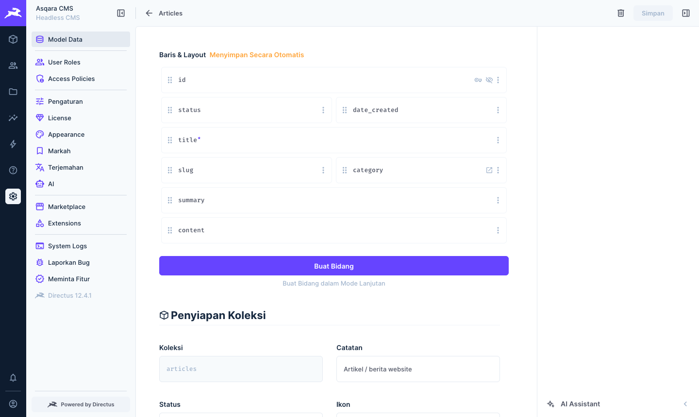
</p>

> [!TIP]
> Malas klik satu per satu? Jalankan `./scripts/seed.sh` dan kedua koleksi beserta isinya akan dibuat otomatis.

---

### 2️⃣ Mengisi Konten

1. Buka menu **Content (📦) → Artikel**.
2. Klik tombol **Buat** di kanan atas.
3. Isi judul, ringkasan, pilih kategori, lalu tulis isi artikel di editor.
4. Ubah **Status** menjadi **Published** jika siap tayang, lalu klik **Simpan**.

<p align="center">
  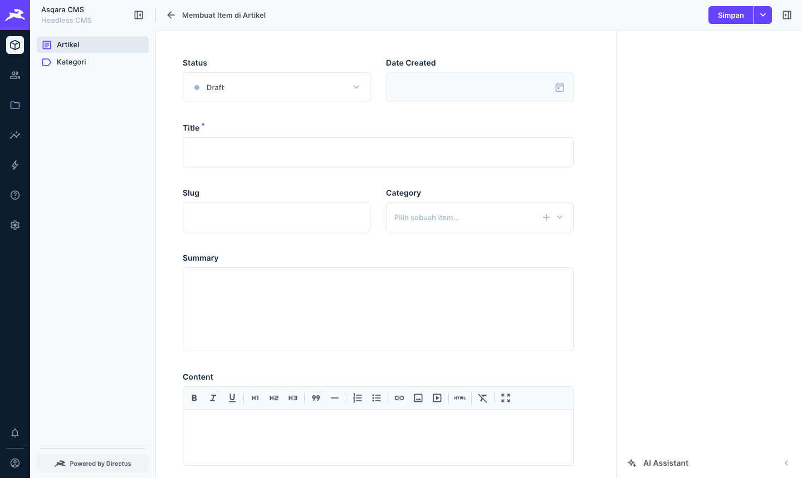
  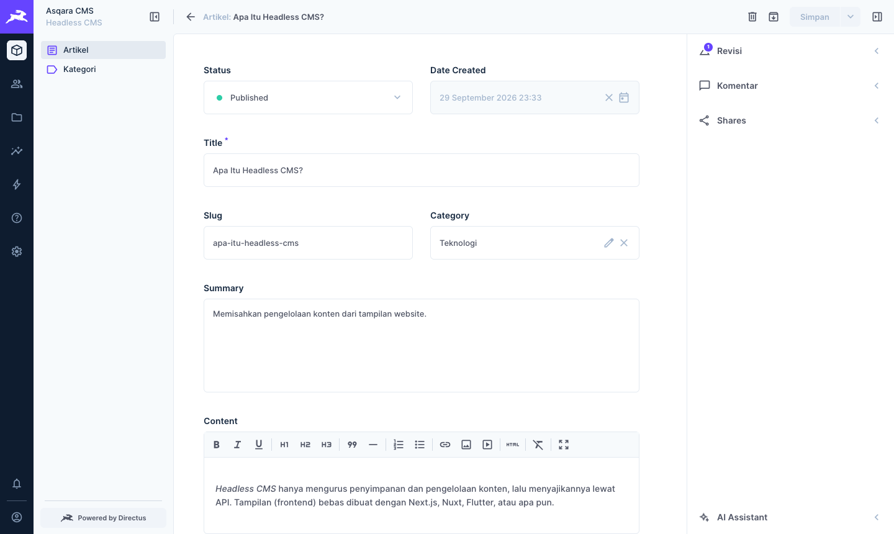
</p>

Semua artikel tampil dalam tabel yang bisa di-*filter*, di-*sort*, dan dicari:

<p align="center"></p>

> 💡 Setiap perubahan tercatat di panel **Revisi** (kanan), sehingga versi lama bisa dilihat dan dikembalikan kapan saja.

---

### 3️⃣ Mengelola Pengguna & Hak Akses

Directus memakai konsep **User → Role → Policy → Permission**:

| Konsep | Contoh |
|---|---|
| **User** | `budi@asqara.tech` |
| **Role** | *Editor*, *Penulis* |
| **Policy** | *"Boleh baca & ubah artikel, tidak boleh hapus"* |
| **Permission** | Aksi **Buat / Baca / Perbarui / Hapus** per koleksi |

**Membuat user Editor:**
1. **Settings → Access Policies → ＋** → beri nama `Editor`, centang **App Access**, lalu tambahkan permission koleksi `articles` & `categories` (Buat, Baca, Perbarui).
2. **Settings → User Roles → ＋** → buat role `Editor`, lalu tambahkan policy `Editor`.
3. **User Directory → ＋** → isi email & password, pilih role `Editor`.

<p align="center">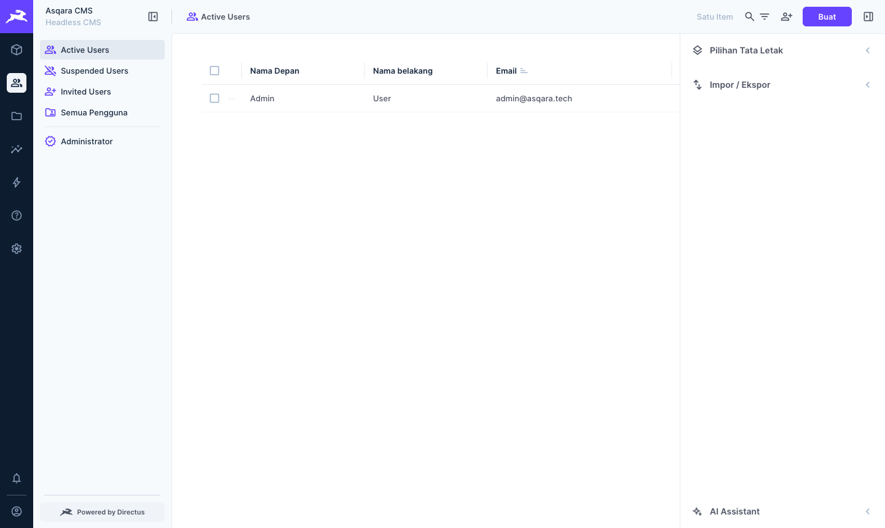</p>

---

<a id="publik"></a>

### 4️⃣ Membuka Konten ke Publik

Secara default **semua data bersifat privat**. Agar website bisa membaca artikel tanpa login:

1. Buka **Settings → Access Policies → Publik**.
2. Klik **Add Collection** → pilih `articles` dan `categories`.
3. Klik ikon aksi **Baca** hingga berwarna ungu (✔ diizinkan). **Simpan**.

<p align="center">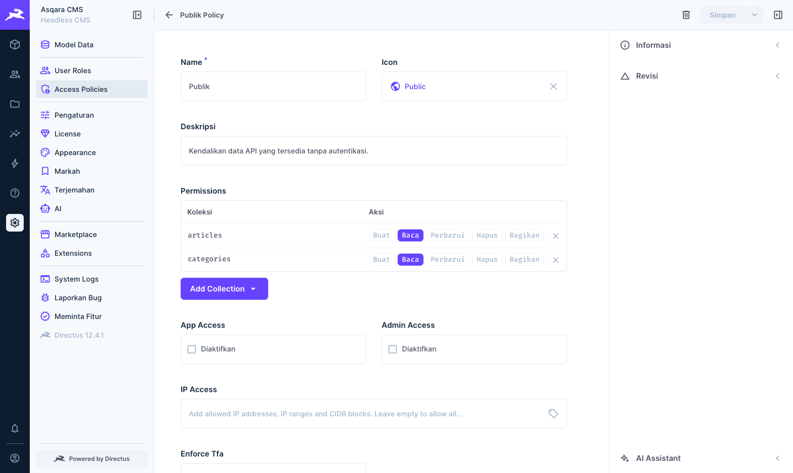</p>

---

### 5️⃣ Mengambil Data Lewat API

Setelah dibuka ke publik, data bisa langsung diambil oleh aplikasi apa pun.

**REST API** dengan `curl`:

```bash
curl -s "https://cms.asqara.tech/items/articles?fields=id,title,category.name&filter[status][_eq]=published" | jq
```

<p align="center">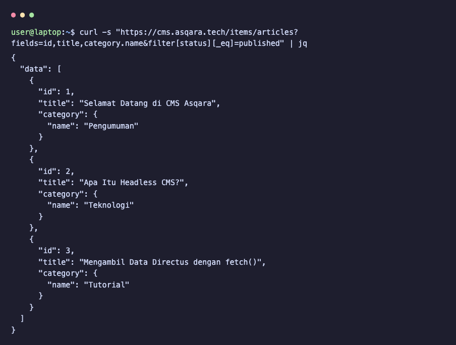</p>

**Cheat-sheet query yang sering dipakai:**

| Kebutuhan | URL |
|---|---|
| Semua artikel | `/items/articles` |
| Satu artikel (id = 1) | `/items/articles/1` |
| Pilih kolom tertentu | `/items/articles?fields=title,summary` |
| Ikutkan data relasi | `/items/articles?fields=*,category.name` |
| Filter status | `/items/articles?filter[status][_eq]=published` |
| Cari kata | `/items/articles?search=headless` |
| Urutkan terbaru | `/items/articles?sort=-date_created` |
| Halaman 2, 10 per halaman | `/items/articles?limit=10&page=2` |

**GraphQL** (endpoint `/graphql`):

```graphql
query {
  articles(filter: { status: { _eq: "published" } }, sort: ["-date_created"]) {
    title
    summary
    category { name }
  }
}
```

**JavaScript** (di website/frontend):

```js
const res = await fetch(
  "https://cms.asqara.tech/items/articles?fields=title,summary&filter[status][_eq]=published"
);
const { data } = await res.json();
console.log(data); // [{ title: "Selamat Datang di CMS Asqara", ... }, ...]
```

---

### 6️⃣ Mengelola File & Gambar

Buka **File Library (📁)**, lalu *drag & drop* gambar. Setiap file bisa diakses dan **diubah ukurannya langsung lewat URL**:

```
https://cms.asqara.tech/assets/<id-file>?width=800&format=webp&quality=80
```

Sangat berguna untuk menampilkan *thumbnail* tanpa perlu mengolah gambar secara manual.

---

<a id="maintenance"></a>

# 🔧 Maintenance
[`^ kembali ke atas ^`](#)

Semua perintah di bawah dijalankan dari folder `/opt/directus`.

### 📟 Perintah Sehari-hari

| Kebutuhan | Perintah |
|---|---|
| Lihat status container | `docker compose ps` |
| Lihat log Directus (*live*) | `docker compose logs -f directus` |
| Restart Directus | `docker compose restart directus` |
| Matikan semua | `docker compose down` |
| Nyalakan semua | `docker compose up -d` |
| Cek kesehatan | `curl https://cms.asqara.tech/server/health` |
| Pemakaian CPU/RAM | `docker stats` |

### 💾 Backup & Restore

**Backup manual:**

```bash
./scripts/backup.sh
```

Menghasilkan dua file di folder `backups/`:
- `db-YYYYMMDD-HHMMSS.sql.gz` → isi database
- `uploads-YYYYMMDD-HHMMSS.tar.gz` → file yang di-upload

**Restore** (mengembalikan data dari backup):

```bash
./scripts/restore.sh backups/db-20260929-020000.sql.gz backups/uploads-20260929-020000.tar.gz
```

> [!TIP]
> Simpan salinan backup **di luar server** juga (Google Drive, laptop, dsb.). Contoh menyalin ke laptop:
> ```bash
> scp user@<IP-server>:/opt/directus/backups/db-*.sql.gz ./
> ```

### ⬆️ Update Versi Directus

1. **Backup dulu!** → `./scripts/backup.sh`
2. Baca [catatan rilis](https://github.com/directus/directus/releases) untuk memastikan tidak ada *breaking change*.
3. Ubah versi di `.env`, mis. `DIRECTUS_VERSION=12.5.0`
4. Terapkan:
   ```bash
   docker compose pull && docker compose up -d
   ```

Migrasi database dijalankan **otomatis** saat container menyala.

### 🚧 Maintenance Mode

Ingin menutup akses sementara (mis. saat migrasi data atau update)? Konfigurasi Nginx kami sudah mendukung **maintenance mode**: selama file `/var/www/html/maintenance.html` ada, semua pengunjung melihat halaman perbaikan (HTTP 503).

**Aktifkan:**

```bash
echo '<h1 style="font-family:sans-serif;text-align:center;margin-top:20vh">🛠️ Sedang dalam perbaikan, kembali sebentar lagi 🙏</h1>' \
  | sudo tee /var/www/html/maintenance.html
```

**Nonaktifkan:**

```bash
sudo rm /var/www/html/maintenance.html
```

Tidak perlu restart apa pun, perubahan langsung berlaku.

### 🩺 Troubleshooting (Masalah Umum)

| Gejala | Penyebab | Solusi |
|---|---|---|
| **502 Bad Gateway** | Container Directus mati / belum siap | `docker compose ps` lalu `docker compose logs directus` |
| `nginx.service is not active` / Nginx gagal start | Port 80/443 sudah dipakai program lain (sering: **Apache**) | Cek `sudo ss -tlnp \| grep -E ':80\|:443'`, lalu matikan, mis. `sudo systemctl disable --now apache2`, kemudian `sudo systemctl enable --now nginx` |
| Upload gagal, error `EACCES` | Folder `uploads` bukan milik UID 1000 | `sudo chown -R 1000:1000 uploads extensions` |
| Upload gagal, error **413** | File melebihi batas Nginx | Naikkan `client_max_body_size` di Nginx & `FILES_MAX_UPLOAD_SIZE` di `.env` |
| Certbot gagal (`NXDOMAIN` / *timeout*) | DNS belum mengarah / port 80 tertutup | Cek `nslookup`, matikan proxy Cloudflare, buka port 80 |
| Gambar/link file mengarah ke `localhost` | `PUBLIC_URL` salah | Perbaiki di `.env`, lalu `docker compose up -d` |
| API publik mengembalikan **403** | Koleksi belum diberi izin di policy **Publik** | Lihat [langkah 4️⃣](#publik) |
| Mengubah `ADMIN_PASSWORD` di `.env` tidak berpengaruh | Variabel itu hanya dipakai saat instalasi pertama | Gunakan perintah reset password di bawah |

**Lupa password admin?** Reset langsung dari server:

```bash
docker compose exec directus node cli.js users passwd --email admin@asqara.tech --password PasswordBaru123
```

---

<a id="pembahasan"></a>

# 💬 Pembahasan
[`^ kembali ke atas ^`](#)

### ✅ Kelebihan Directus

- **Database-first, tanpa *vendor lock-in*.** Data disimpan sebagai tabel SQL biasa. Jika suatu saat berhenti memakai Directus, data tetap utuh dan bisa dibaca aplikasi lain. Directus juga bisa "menempel" ke database yang **sudah ada**.
- **API instan & lengkap.** REST dan GraphQL langsung tersedia beserta filter, relasi, pagination, pencarian, dan agregasi, tanpa menulis satu baris kode backend pun.
- **Panel admin sangat ramah pengguna.** Cocok untuk tim konten non-programmer, dan tersedia dalam **Bahasa Indonesia**.
- **Mendukung banyak database:** PostgreSQL, MySQL, MariaDB, SQLite, MS SQL Server, Oracle, dan CockroachDB.
- **Fitur bawaan kaya:** manajemen file + transformasi gambar, revisi/riwayat perubahan, Flows (otomatisasi), Insights (dashboard), realtime WebSocket.
- **Instalasi mudah** berkat image Docker resmi. Kami berhasil menjalankannya dengan **1 file `docker-compose.yml`**.

### ⚠️ Kekurangan Directus

- **Lisensi bukan lagi *open source* murni.** Sejak versi 10 memakai lisensi *source-available* (BSL 1.1), dan sejak **Directus 12** memakai **MSCL-1.0-GPL** dengan *license enforcement* aktif. Instance tanpa lisensi berjalan di tier **Core**, sementara beberapa fitur butuh lisensi: **SSO login**, **custom permission rules**, dan **koneksi LLM kustom**.
- **Temuan kami saat instalasi:** kami ingin membuat aturan *"publik hanya boleh membaca artikel berstatus published"*. Di Directus 12 tanpa lisensi, API menolak dengan pesan `custom_permission_rules_enabled is a restricted resource`. **Solusinya**, filter dipindahkan ke sisi frontend (`?filter[status][_eq]=published`). Konsekuensinya, artikel *draft* tetap bisa dibaca publik jika seseorang sengaja menghapus filter tersebut.
- **Gratis untuk organisasi kecil saja.** Penggunaan komersial gratis (*Open Innovation Grant*) hanya berlaku untuk organisasi dengan pendapatan < **US$5 juta/tahun** dan < **50 karyawan**.
- **Headless = butuh frontend terpisah.** Directus tidak menyediakan tema website seperti WordPress, jadi tampilan website harus dibuat sendiri (Next.js, Nuxt, dll.).
- **Lebih berat dari CMS PHP sederhana.** Butuh Node.js (via Docker) dengan RAM minimal ±1 GB, sehingga kurang cocok untuk *shared hosting* murah.
- Dokumentasi berbahasa Indonesia dan komunitas lokal masih sedikit.

### ⚖️ Perbandingan dengan Aplikasi Sejenis

| Aspek | 🐰 **Directus** | 🟣 **Strapi** | ⬛ **Payload CMS** | 🔵 **WordPress** |
|---|---|---|---|---|
| Jenis | Headless CMS | Headless CMS | Headless CMS | CMS tradisional (bisa headless) |
| Bahasa | Node.js (TypeScript) + Vue.js | Node.js (TypeScript) + React | TypeScript + Next.js | PHP |
| Lisensi | MSCL-1.0-GPL (Core gratis, sebagian fitur berbayar) | MIT (fitur *enterprise* berbayar) | MIT | GPLv2 |
| Cara membuat struktur data | **No-code** lewat panel | No-code (*Content-Type Builder*), disimpan sebagai file kode | **Kode** (file konfigurasi TypeScript) | Plugin (ACF, CPT UI) |
| Database | PostgreSQL, MySQL, MariaDB, SQLite, MSSQL, Oracle, CockroachDB | PostgreSQL, MySQL, MariaDB, SQLite | PostgreSQL, MongoDB, SQLite | MySQL / MariaDB |
| Pakai database yang sudah ada | ✅ Ya | ❌ Tidak | ❌ Tidak | ❌ Tidak |
| REST API | ✅ Bawaan | ✅ Bawaan | ✅ Bawaan | ✅ Bawaan |
| GraphQL | ✅ Bawaan | ✅ Plugin resmi | ✅ Bawaan | ⚠️ Plugin (WPGraphQL) |
| Realtime (WebSocket) | ✅ Bawaan | ❌ | ❌ | ❌ |
| Otomatisasi tanpa kode | ✅ Flows | ⚠️ Webhooks | ⚠️ Hooks (kode) | ⚠️ Plugin |
| Tema website bawaan | ❌ | ❌ | ❌ | ✅ Ribuan tema |
| Paling cocok untuk | Tim campuran (dev + non-dev), data sudah di SQL | Developer JavaScript | Developer Next.js/TypeScript | Blog & company profile |

**Kesimpulan:** Directus unggul jika ingin **cepat punya backend + panel admin** di atas database SQL tanpa menulis kode, dan panelnya nyaman dipakai tim non-teknis. **Strapi** dan **Payload** lebih bebas dari sisi lisensi (MIT) dan cocok bagi developer yang ingin mendefinisikan skema lewat kode. **WordPress** tetap paling praktis untuk website sederhana yang butuh tema siap pakai, tetapi kurang ideal sebagai *backend* API multi-platform.

---

<a id="referensi"></a>

# 📚 Referensi
[`^ kembali ke atas ^`](#)

1. [Directus Documentation](https://directus.com/docs) — Directus
2. [Self-Hosting: Deploying Directus with Docker](https://directus.com/docs/self-hosting/deploying) — Directus
3. [Breaking Changes: Version 12](https://directus.com/docs/releases/breaking-changes/version-12) — Directus
4. [Licensing Overview](https://directus.com/docs/licensing/overview) — Directus
5. [Directus Releases](https://github.com/directus/directus/releases) — GitHub
6. [Install Docker Engine on Ubuntu](https://docs.docker.com/engine/install/ubuntu/) — Docker Docs
7. [Certbot Instructions (Nginx on Ubuntu)](https://certbot.eff.org/instructions?ws=nginx&os=snap) — EFF
8. [NGINX Reverse Proxy](https://docs.nginx.com/nginx/admin-guide/web-server/reverse-proxy/) — NGINX Docs
9. [awesome-selfhosted](https://github.com/awesome-selfhosted/awesome-selfhosted) — daftar aplikasi *self-hosted*
10. [Strapi](https://strapi.io/) · [Payload CMS](https://payloadcms.com/) · [WordPress REST API](https://developer.wordpress.org/rest-api/) — pembanding

---

<p align="center">
  Dibuat untuk Proyek Akhir mata kuliah <b>Komunikasi Data & Jaringan Komputer</b> 🧡<br>
  <sub>Departemen Ilmu Komputer — IPB University</sub>
</p>
